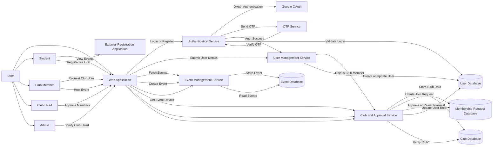

# 📚 Data Structures & Algorithms (DSA) Repository

Welcome to my **DSA Practice Repository**!  

This repository is dedicated to storing all my **Data Structures and Algorithms** practice problems, solutions, and notes. I am following **Striver's A to Z DSA Course**, and this repo will serve as a record of my learning journey.

---

## Leetcode Stats

## Geeks For Geeks Stats

