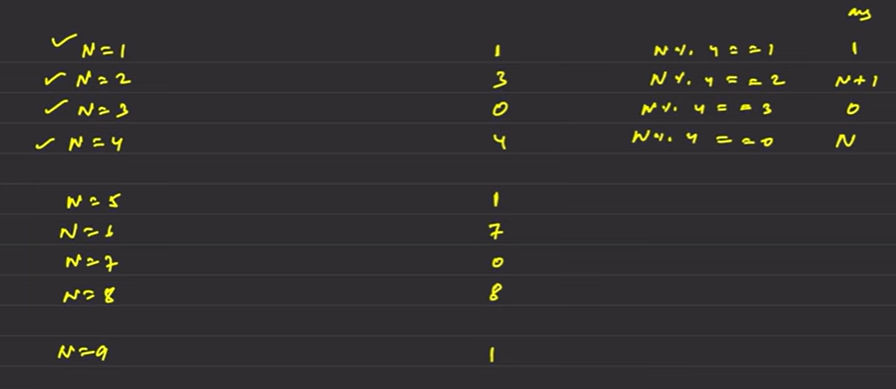
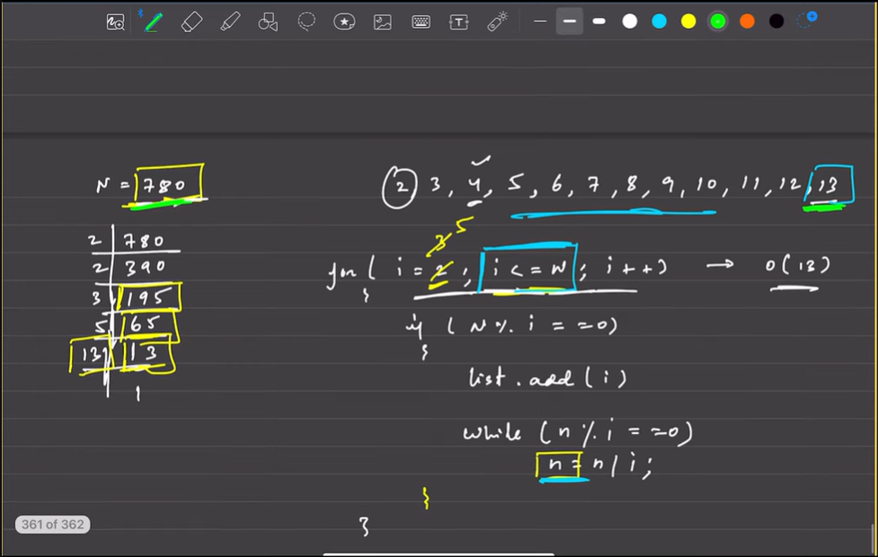
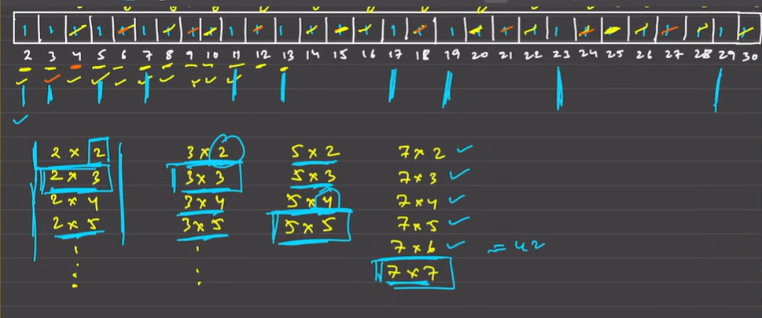

# Bit - Manipulation

## Table of content
- [Bit - Manipulation](#bit---manipulation)
  - [Table of content](#table-of-content)
  - [1. Divide two integers without using multiplication, division and mod operator](#1-divide-two-integers-without-using-multiplication-division-and-mod-operator)
    - [Approach](#approach)
  - [2. Count number of bits to be flipped to convert A to B](#2-count-number-of-bits-to-be-flipped-to-convert-a-to-b)
    - [Approach](#approach-1)
  - [3. Find the number that appears odd number of times](#3-find-the-number-that-appears-odd-number-of-times)
    - [Approach](#approach-2)
  - [4. Power Set](#4-power-set)
    - [Approach](#approach-3)
  - [5. Find xor of numbers from L to R](#5-find-xor-of-numbers-from-l-to-r)
    - [Approach](#approach-4)
  - [6. Find the two numbers appearing odd number of times](#6-find-the-two-numbers-appearing-odd-number-of-times)
    - [Approach](#approach-5)
  - [7. Prime Factors](#7-prime-factors)
    - [Approach](#approach-6)
  - [8. All Divisors of a Number](#8-all-divisors-of-a-number)
    - [Approach](#approach-7)
  - [9. Sieve of Eratosthenes \[ New Algorithm VIMP \]](#9-sieve-of-eratosthenes--new-algorithm-vimp-)
    - [Algorithm](#algorithm)
  - [10. Find Prime Factorisation of a Number using Sieve](#10-find-prime-factorisation-of-a-number-using-sieve)
    - [Approach](#approach-8)
  - [11. Power(n, x)](#11-powern-x)
    - [Approach](#approach-9)

## 1. Divide two integers without using multiplication, division and mod operator
- **Link** -> https://leetcode.com/problems/divide-two-integers/submissions/1861400382/
- **Rating** -> 3⭐
- **Medium** -> MEDIUM
### Approach
1. we could just add up the **divisor** at many times until it reaches close to **dividend**  
2. By some reverse Engineering we colud do like divisor * 20, divisor * 21, divisor * 22, divisor * 23 until it gets close to the dividend
3. We could reduce the numbers of additions like **n** times to some **log n**
2. Each time we will reduce the **divisor * 2count** from the dividend and count by simply adding 2count
3. Complexity:
    - `Time` -> *O(log2n)2*
    - `Space` -> *O(1)*
4. [To Table Of Content](#table-of-content)

## 2. Count number of bits to be flipped to convert A to B
- **Link** -> https://leetcode.com/problems/minimum-bit-flips-to-convert-number/submissions/1861474115/
- **Rating** -> 4⭐
- **Medium** -> EASY
### Approach
1. `FIRST APPROACH`: We can use **AND** operator AND with start and goal if it doesn't match increement the counter
2. Complexity:
    - `Time` -> *O(31)*
    - `Space` -> *O(1)*
3. `SECOND APPROACH`: we can use **XOR** like **start ^ goal** the number it will give we just have to count the number of set bits
4. We can also do like insted of counting the number of set bit just do the procedure to convert the number to binary and count the number of set bits
5. Complexity:
    - `Time` -> *O(logn)*
    - `Space` -> *O(1)* 
6. [To Table Of Content](#table-of-content)

## 3. Find the number that appears odd number of times
- **Link** -> https://leetcode.com/problems/single-number/description/
- **Rating** -> 3⭐
- **Medium** -> EASY
### Approach
1. As we know `1 ^ 1` results to **0**
2. So we can use the same concept we will xor all the numbers in the array, the number appeared once will only remail in the end
3. Complexity:
    - `Time` -> *O(n)*
    - `Space` -> *O(1)* 
4. [To Table Of Content](#table-of-content)

## 4. Power Set
- **Link** -> https://leetcode.com/problems/subsets/description/
- **Rating** -> 3⭐
- **Medium** -> MEDIUM
### Approach
1. As we know number of sub sets will be **2n** including the empty subset
2. We can use the bits of each number to decide wether to take the number or not
3. like 1 -> 001, 2 -> 010, 5 -> 101, 7 -> 111, 0 -> 000 we can use all those combination to form subArray
4. We would take the elements who have set bit, to find out which bit is set we can use `AND` operator and `LEFT SHIFT`
6. i & (1<<j) this will give us whether the bit is set or not if yes then we would take the num at pos **'j'**
7. Complexity:
  - `Time` -> *O(2n * n)*
  - `Space` -> *O(2n * n)* -> nearly ( close )
8. [To Table Of Content](#table-of-content)

## 5. Find xor of numbers from L to R
- **Link** -> https://www.geeksforgeeks.org/problems/find-xor-of-numbers-from-l-to-r/1
- **Rating** -> 3⭐
- **Medium** -> MEDIUM
### Approach
1. Try to do some observation in `XOR` till n

2. As we can i forms an pattern for each number using those we can derive some conditions
3. For questions like from left to right we can use the above results
4. ex. 4 -> 8 we can do like xor(xor(1 -> 3) xor(1 -> 8)) -> (1^2^3) ^ (1^2^3^4^5^6^7^8)
5. If we observed carefuly xor of same is number is 0 so the above will result in 4^5^6^7^8
6. Complexity:
  - `Time` -> *O(1)*
  - `Space` -> *O(1)*
7. [To Table Of Content](#table-of-content)

## 6. Find the two numbers appearing odd number of times
- **Link** -> https://www.geeksforgeeks.org/problems/two-numbers-with-odd-occurrences5846/1
- **Rating** -> 3⭐
- **Medium** -> MEDIUM
### Approach
1. As we have done in single odd appearing number we will do `XOR` for all the elements
2. The main concern is how to seperate the numbers after the XOR of all the elements
3. XOR gives us the bit set where both the number differ 1010 ^ 1000 -> 0010 
4. We should find the right most set bit using setNum = (num & num-1) ^ num this will give us the right most set bit
5. We will create two buckets numbers haveing the bit set as **setNum** and another without
6. In each bucket we will get both the numbers seperated and if we perform the individual `XOR` we will get the number itself
7. **IMP** -> it the XOR of all elements comes out to be -231 doing something like -231 - 1 will overflow it so while storing the XOR of all the elements use `Long Long`
8. Complexity: 
  - `Time` -> *O(2N)*
  - `Space` -> *O(1)*
9. [To Table Of Content](#table-of-content)

## 7. Prime Factors
- **Link** -> https://www.geeksforgeeks.org/problems/prime-factors5052/1
- **Rating** -> 2⭐
- **Medium** -> HARD
### Approach

1. Above is the basic logic and pseudo code for obtaining the prime factors of an given elements
2. But there is one flaw of this code if the number is self is prime number like 13, 37 the loop will process of *O(n)* complexity
3. What we can do is like use **i<=√n** which will give same as before but it will not give the prime number is self
4. To overcome it we can do **if(n != 1) ans.push_back(n);**
5. Complexity:
  - `TIme` -> *O(√n * logn)*
  - `Space` -> *O( )* -> can't be predicted
6. [To Table Of Content](#table-of-content)

## 8. All Divisors of a Number
- **Link** -> https://www.geeksforgeeks.org/problems/all-divisors-of-a-number/1
- **Rating** -> 3⭐
- **Difficulty** -> EASY
### Approach
1. The extreme naive solution could be we can iterate form i -> n if the number perfectly divide n add to ans 
2. We can optimise it using the table

| Factor A | 1 | 2 | 3 | 4 | 6 | 9 | 12 | 18 | 36 |
|----------|---|---|---|---|---|---|----|----|----|
| **Factor B** | **36** | **18** | **12** | **9** | **6** | **4** | **3** | **2** | **1** |
3. As we can see in the table from both the side until 6 ( which is sqrt of 36 ) we each number insted of taking all the nunmber from one side
4. we will take the i and also n/i if it is not similar to i
5. Complexity:
  - `Time` -> *O(√n)*
  - `Space` -> *O(1)*
6. [To Table Of Content](#table-of-content)

## 9. Sieve of Eratosthenes [ New Algorithm VIMP ]
- **Link** -> https://leetcode.com/problems/count-primes/description/
- **Rating** -> 2⭐
- **Difficulty** -> HARD
### Algorithm

1. What is am prime number the number with only two divisors 1 and itself
2. We will create an array until n+1 and mark each pos as 1
3. We will iterate from 2 -> n+1 and mark 0 to the multiple of the pos we are at which
4. ex. at pos: 2 we will mark 4, 6, 8, 10,... 
5. The pos with value 1 are prime numbers
6. To optimize it we can observe the tables below in the image 
7. For all the multiples of 2 * 3, 2 * 4, 2 * 5, so for multiple of 3 -> 3 * 2, 3 * 3
8. We don't need to perform 3 * 2 which is already covered in multiple of 2 -> 2 * 3
9. So for the inner loop we will start from j=i*i insted of just i
10. As we are performing i*i no need to iterate i form 2 -> n we only need to iterate till √n
11. If n is 30 and i = 6 the inner loop j = i*i -> 36 will never work so we only nedd to iterate till √30 -> 5.3
12. Complexity:
  - `Time` -> *O(n)* for allocation of 1 to each pos in an array, *O(nlog(logn))* no proof mathematically derived time complexity
  - `Space` -> *O(n)*
13. [To Table Of Content](#table-of-content)
	
## 10. Find Prime Factorisation of a Number using Sieve
- **Link** -> https://www.geeksforgeeks.org/problems/prime-factorization-using-sieve/1
- **Rating** -> 4⭐
- **Difficulty** -> HARD
### Approach
1. For this question we can use the 7. Prime Factors just change the position of adding to ans
2. TO optimize it we can use 9. Sieve of Eratosthenes Algorithm
3. It will return the smallest divisor of the number is *O(1)* complexity
4. Just a small change in it like insted of 1 at each palce will place the pos itself
5. While iterating replace it with the number it is been divided
6. If at any place there is conflict that the pos is already divided one by one of prime number don't change it
7. Complexity:
  - `Time` -> *O(log2n) + O(nlog(logn))*
  - `Space` -> *O(n)*
8. [To Table Of Content](#table-of-content)

## 11. Power(n, x)
- **Link** -> https://leetcode.com/problems/powx-n/description/
- **Rating** -> 3⭐
- **Difficulty** -> EASY
### Approach
1. We can iterate through 1 -> n and multiply to iteself for each iteration 
2. To optimize it we do like if n is 230 -> (22)15 -> (4)15
3. For each iteration we can reduce it by half if the number is even
4. If the number is oddd we can reduce it by one and multiply the answer it by once
5. Complexity:
  - `Time` -> *O(logn)*
  - `Space` -> *O(1)*
6. [To Table Of Content](#table-of-content)