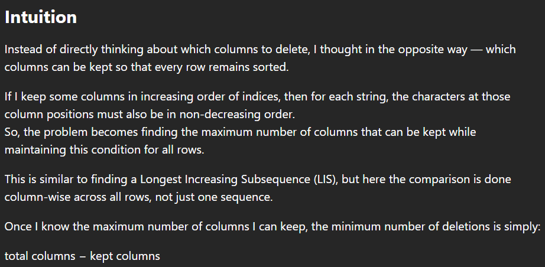
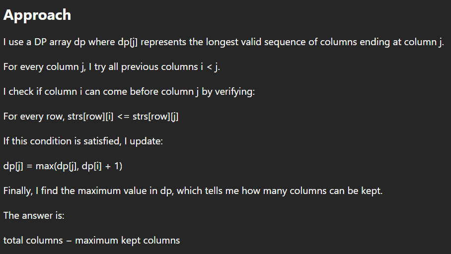
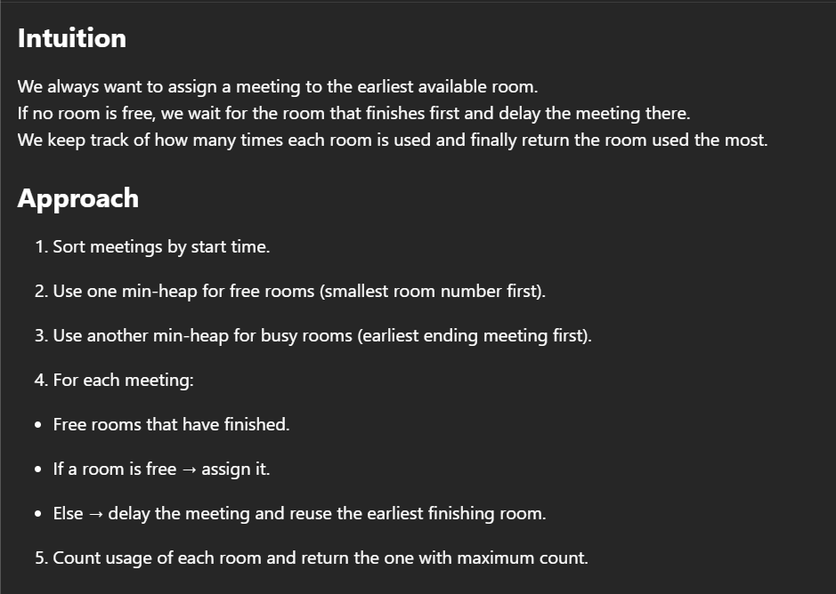
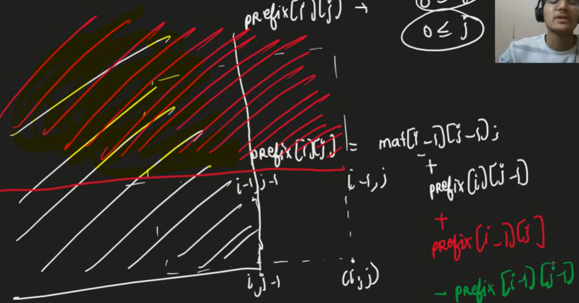

# Daily Question Of Leetcode

## Table Of Content
- [Daily Question Of Leetcode](#daily-question-of-leetcode)
  - [Table Of Content](#table-of-content)
  - [**Leetcode 3433** \[ Count Mentions Per User \]](#leetcode-3433--count-mentions-per-user-)
    - [Approach](#approach)
  - [**Leetcode 3606** \[ Coupon Code Validator \]](#leetcode-3606--coupon-code-validator-)
    - [Approach](#approach-1)
  - [**Leetcode 2147** \[ Number of Ways to Divide a Long Corridor \]](#leetcode-2147--number-of-ways-to-divide-a-long-corridor-)
    - [Approach](#approach-2)
  - [**Leetcode 2110** \[ Number of Smooth Descent Periods of a Stock \]](#leetcode-2110--number-of-smooth-descent-periods-of-a-stock-)
    - [Approach](#approach-3)
  - [**Leetcode 955** \[Delete Columns to Make Sorted I\]](#leetcode-955-delete-columns-to-make-sorted-i)
  - [**Leetcode 955** \[Delete Columns to Make Sorted II\]](#leetcode-955-delete-columns-to-make-sorted-ii)
  - [**Leetcode 960** \[Delete Columns to Make Sorted III\]](#leetcode-960-delete-columns-to-make-sorted-iii)
  - [**Leetcode 2054** \[Two Best Non-Overlapping Events\]](#leetcode-2054-two-best-non-overlapping-events)
    - [Approach](#approach-4)
  - [**Leetcode 3074** \[Apple Redistribution into Boxes\]](#leetcode-3074-apple-redistribution-into-boxes)
    - [Approach](#approach-5)
  - [**Leetcode 3075** \[Maximize Happiness of Selected Children\]](#leetcode-3075-maximize-happiness-of-selected-children)
    - [Approach](#approach-6)
  - [**Leetcode 2483** \[Minimum Penalty for a Shop\]](#leetcode-2483-minimum-penalty-for-a-shop)
    - [Approach](#approach-7)
  - [**Leetcode 2402** \[Meeting Rooms III\] 1⭐](#leetcode-2402-meeting-rooms-iii-1)
    - [Approach](#approach-8)
  - [**Leetcode 1351** \[Count Negative Numbers in a Sorted Matrix\] 4⭐](#leetcode-1351-count-negative-numbers-in-a-sorted-matrix-4)
    - [Approach](#approach-9)
  - [**Leetcode 756** \[Pyramid Transition Matrix\] 2⭐](#leetcode-756-pyramid-transition-matrix-2)
    - [Approach](#approach-10)
  - [**Leetcode 840** \[Magic Squares In Grid\] 4⭐](#leetcode-840-magic-squares-in-grid-4)
    - [Approach](#approach-11)
  - [**Leetcode 1970** \[Last Day Where You Can Still Cross\] 1⭐](#leetcode-1970-last-day-where-you-can-still-cross-1)
    - [Approach](#approach-12)
  - [**Leetcode 66** \[Plus One\] 5⭐](#leetcode-66-plus-one-5)
    - [Approach](#approach-13)
  - [**Leetcode 961** \[N-Repeated Element in Size 2N Array\] 3⭐](#leetcode-961-n-repeated-element-in-size-2n-array-3)
    - [Approach](#approach-14)
  - [**Leetcode 1411** \[Number of Ways to Paint N × 3 Grid\] 3⭐](#leetcode-1411-number-of-ways-to-paint-n--3-grid-3)
    - [Approach](#approach-15)
  - [**Leetcode 1390** \[Four Divisors\] 4⭐](#leetcode-1390-four-divisors-4)
    - [Approach](#approach-16)
  - [**Leetcode 1975** \[Max Matrix Sum\] 3⭐](#leetcode-1975-max-matrix-sum-3)
    - [Approach](#approach-17)
  - [**Leetcode 1161** \[Maximum Level Sum of a Binary Tree\] 3⭐](#leetcode-1161-maximum-level-sum-of-a-binary-tree-3)
    - [Approach](#approach-18)
  - [**Leetcode 1339** \[Maximum Product of Splitted Binary Tree\] 3⭐](#leetcode-1339-maximum-product-of-splitted-binary-tree-3)
    - [Approach](#approach-19)
  - [**Leetcode 1458** \[Max Dot Product of Two Subsequences\] 1⭐](#leetcode-1458-max-dot-product-of-two-subsequences-1)
    - [Approach](#approach-20)
  - [**Leetcode 865 \& Leetcode 1123** \[Smallest Subtree with all the Deepest Nodes\] 2⭐](#leetcode-865--leetcode-1123-smallest-subtree-with-all-the-deepest-nodes-2)
    - [Approach](#approach-21)
  - [**Leetcode 712** 2⭐](#leetcode-712-2)
    - [Approach](#approach-22)
  - [**Leetcode 85** \[Maximum Rectangle\] 2⭐](#leetcode-85-maximum-rectangle-2)
    - [Approach](#approach-23)
  - [**Leetcode 1266** \[Minimum Time Visiting All Points\] 4⭐](#leetcode-1266-minimum-time-visiting-all-points-4)
    - [Approach](#approach-24)
  - [**Leetcode 3453** \[Seperate squares I\] 3⭐](#leetcode-3453-seperate-squares-i-3)
    - [Approach](#approach-25)
  - [**Leetcode 3554** \[Seperate square II\] 0⭐](#leetcode-3554-seperate-square-ii-0)
    - [Approach](#approach-26)
  - [**2943** \[Maximize Area of Square Hole in Grid\] 4⭐](#2943-maximize-area-of-square-hole-in-grid-4)
    - [Approach](#approach-27)
  - [**1291** \[Maximum Side Length of a Square with Sum Less than or Equal to Threshold\] 3⭐](#1291-maximum-side-length-of-a-square-with-sum-less-than-or-equal-to-threshold-3)
    - [Approach](#approach-28)
  - [**3315** \[Construct the Minimum Bitwise Array II\] 2⭐](#3315-construct-the-minimum-bitwise-array-ii-2)
    - [Approach](#approach-29)

## **Leetcode 3433** [ Count Mentions Per User ]
- **Date** -> 12/12/2025
- **Link** -> https://leetcode.com/problems/count-mentions-per-user/description/
- **Rating** -> 2⭐
- **Difficulty** -> Medium
### Approach
1. Declare three vector
   - `online` -> To track the users online currently
   - `mentions` -> TO store each mention of each user
   - `offlineEnd` -> To store the end of the **offline** period of the user
2. Sort the events vector according to `timeStamp` as pos **1** in tuple, If the conflict in the **MESSAGE** and **OFFLINE** occur for same `timeStamp` take **OFFLINE**
3. Seperate each term from the tuple as `type`, `timestamp`, `data`
4. Before entering the **if else** check the `offlinieEnd` if **timestamp** is more than offlineEnd than make the user **online**
5. Perform the task as per mentioned in the `type` using nested **if else** statements
    - `OFFLINE` -> make the **online** at id false and calculate the offlineEnd and store it
    - `MESSAGE` -> 
      - `HERE` -> **+1** for only the users who are online
      - `ALL` -> **+1** for each user rather it be offline
      - `id` -> **+1** only at the mentioned id if online
6. Complexicity ( **n = numberOfUsers, m = events.size(), k = average number of tokens in a "MESSAGE" event** )
   - **Time** -> *O(mlogm)+O(m⋅n)+O(m⋅k⋅n)​*
   - **Space** -> *O(m⋅n⋅k)​*
7. [Table Of Content](#table-of-content)

## **Leetcode 3606** [ Coupon Code Validator ]
- **Date** -> 13/12/2025
- **Link** -> https://leetcode.com/problems/coupon-code-validator/description/
- **Rating** -> 4⭐
- **Difficulty** -> Easy
### Approach
1. Loop the Whole code for number of elements in any one of **properties**
2. Declare seperate variable and store properties `Rcode`, `Rbussiness`, `Ractive`
3. Go through multiple **if else** statement if any of those case fails **continue**
   - `Rcode` -> loop through each char check wether it have any inValid char if any **continue**
   - `Rbussiness` -> If it does not belong to any of provided bussiness **continue**
   - `Ractive`  -> If it is false **continue**
4. If all the above cases pass store the answer
5. Things to taken care of
   - Sort **Rcode** in the result on the basis of there **Rbussiness**
   - `set` can be used but it does not allows **duplicates**, but it **sort** the elements on itself
   - Use alternative `multiset` it allows **duplicates** and also **sort** the elements on it's own
6. Complexicity ( **n: number of elements, l: length of Rcode** )
   - **Time** -> *O(n.L + nlogn)*
   - **Space** -> *O(nlogn)*
7. [Table Of Content](#table-of-content)

## **Leetcode 2147** [ Number of Ways to Divide a Long Corridor ]
- **Date** -> 14/12/2025
- **Link** -> https://leetcode.com/problems/number-of-ways-to-divide-a-long-corridor/description/
- **Rating** -> 3⭐
- **Difficulty** -> HARD
### Approach
1. parse through each char of `corridor`, count the number of **S** if the count is **ODD** return **0**
2. Parse through each char of `corridor` reach until we come across **2 Seats**
3. Count the number plants in between the last **2nd seat** and the first **1st seat**
4. No of ways will be `ways = (ways * (plantCount + 1)) % MOD;` where **MOD = 1e9 + 7**
5. Make the **palntCount = 0** after calclation
6. Complexicity
   - **Time** -> *O(n)*
   - **Space** -> *O(1)*
7. [Table Of Content](#table-of-content)

## **Leetcode 2110** [ Number of Smooth Descent Periods of a Stock ]
- **Date** -> 15/12/2025
- **Link** -> https://leetcode.com/problems/number-of-smooth-descent-periods-of-a-stock/description/
- **Rating** -> 2⭐
- **Difficulty** -> MEDIUM
### Approach
1. Every single day is a valid descent period so we start with `ans = 1` and `len = 1`
1. If today's price one less than yesterdays price increement `len`
3. Else pattern breaks and `len` is reset to **1**
4. At the end of every iteration add the `len` to the `ans`
5. Complexicity
   - Time -> *O(n)*
   - Space -> *O(1)*
6. [Table Of Content](#table-of-content)

## **Leetcode 955** [Delete Columns to Make Sorted I]
- **Date** -> 20/12/2025
- **Link** -> https://leetcode.com/problems/delete-columns-to-make-sorted/description/
- **Rating** -> 4⭐
- **Difficulty** -> Easy
- [Table Of Content](#table-of-content)
 
## **Leetcode 955** [Delete Columns to Make Sorted II]
- **Date** -> 21/12/2025
- **Link** -> https://leetcode.com/problems/delete-columns-to-make-sorted-ii/description/
- **Rating** -> 3⭐
- **Difficulty** -> MEDIUM
- [Table Of Content](#table-of-content)

## **Leetcode 960** [Delete Columns to Make Sorted III]
- **Date** -> 22/12/2025
- **Link** -> https://leetcode.com/problems/delete-columns-to-make-sorted-iii/description/
- **Rating** -> 1⭐
- **Difficulty** -> HARD

- [Table Of Content](#table-of-content)

## **Leetcode 2054** [Two Best Non-Overlapping Events]
- **Date** -> 23/12/2025
- **Link** -> https://leetcode.com/problems/two-best-non-overlapping-events/description/
- **Rating** -> 2⭐
- **Difficulty** -> MEDIUM
### Approach
1. We will sort the jobs by it's starting time 
2. We will start throught each job, with help of binary search we will find the first non-overlappng job
3. We will also generate an maxSuffix array containing the max values upto that location
4. Resulting we can get the max value beyond that job, as the job are sorted all the job after the job we found through BS is valid
5. We will return the max of all the combinations
6. Complexity
   - `Time` -> *O(nlogn)*
   - `Space` -> *O(n)*
7. [Table Of Content](#table-of-content)

## **Leetcode 3074** [Apple Redistribution into Boxes]
- **Date** -> 24/12/2025
- **Link** -> https://leetcode.com/problems/apple-redistribution-into-boxes/description/
- **Rating** -> 4⭐
- **Difficulty** -> EASY
### Approach
1. Count the total numbers of apples to be put into the boxes
2. Sort the `capacity` array, decrease the capacity of each box from the total of apples
3. Maintian the counter how much boxes we use
4. Complexity:
   - `Time` -> *O(n + mlogm)*
   - `Space` -> *O(1)*
5. [Table Of Content](#table-of-content) 

## **Leetcode 3075** [Maximize Happiness of Selected Children]
- **Date** -> 25/12/2025
- **Link** -> https://leetcode.com/problems/maximize-happiness-of-selected-children/description/
- **Rating** -> 4⭐
- **Difficulty** -> MEDIUM
### Approach
1. As we want maximum happiness and answer does not depend on the sewuence we sort the `happiness` vector
2. Inside an for loop we will start from the last element and add it to answer while also counting the number of rounds has been processed
3. Each time we will maintian an counter for nunmber of rounds has been completed and reduce it each time while adding happiness to answer
4. The pos we get the **happiness[i] - rounds** as 0 we will stop ( happiness can't be negative ) return the ans;
5. Complexity:
   - `TIme` -> *O(nlogn)*
   - `Space` -> *O(1)*
6. [Table Of Content](#table-of-content) 

## **Leetcode 2483** [Minimum Penalty for a Shop]
- **Date** -> 26/12/2025
- **Link** -> https://leetcode.com/problems/minimum-penalty-for-a-shop/description/
- **Rating** -> 3⭐
- **Difficulty** -> MEDIUM
### Approach
1. We will calculate the penalty for closing the store at 0
2. We will iterate through a for loop for further closig the store ahead from 0 1 -> n
3. Each time if `'Y'` occurs reduce the panlty or `'N'` increase the penalty
4. At the end of each penalty check for minPenalty and update the answer
5. Complexity:
   - `Time` -> *O(n)*
   - `Space` -> *O(1)*
6. [Table Of Content](#table-of-content) 

## **Leetcode 2402** [Meeting Rooms III] 1⭐
- **Date** -> 27/12/2025
- **Link** -> https://leetcode.com/problems/meeting-rooms-iii/description/
- **Difficulty** -> HARD
### Approach

1. Complexity:
   - `Time` -> *O(mlogn)*
   - `Space` -> *O(n)*
2. [Table Of Content](#table-of-content) 

## **Leetcode 1351** [Count Negative Numbers in a Sorted Matrix] 4⭐
- **Date** -> 28/12/2025
- **Link** -> https://leetcode.com/problems/count-negative-numbers-in-a-sorted-matrix/description/
- **Difficulty** -> EASY
### Approach
1. Iterate an for loop from 1 -> n (size of 2D array)
2. As the sub arrays are sorted we can use binary search to find the first -ve element and calculate
3. For bit bit optimization if the first element itself is negative no need for binary search direct add the size
4. Manage as pos variable to keep track last negative element and make it 0 at start
5. If the pos is not changed from 0 then there is no negative number in the array add m(size of subArray) - pos to ans
6. Complexity:
   - `Time` -> *O(nlogm)*
   - `Space` -> *O(1)*
7. [Table Of Content](#table-of-content) 

## **Leetcode 756** [Pyramid Transition Matrix] 2⭐
- **Date** -> 29/12/2025
- **Link** -> https://leetcode.com/problems/pyramid-transition-matrix/description/
- **Difficulty** -> MEDIUM
### Approach
1. They have given the base of the pyramid we have to build the remaining above layres with the help of the allowed string
2. We will take the window two char from the base and lookout in allowed matching first two char to the window the 3rd char in the allowed string will be the char that will be placed at the top of those two char 
3. We have to find out whether we can form the pyramid or not using those allowed array and base
4. At first we will make an mp to store the allowed in from of `unordered_map<string, vector<char>> mp`
5. We will alse use an ds to store bad layers that can't be build further to avoid unnecessary recursive call of form `unordered_set<string> bad`
   - On purpose we choose the unordered_set as it have an look up time complexicty of *O(1)*
   - It uses hash table to store the values and prevent duplicates as well
6. We will have an temp string to store the next we will take first two char from base take it's allowed add the the temp and call with pos+1
7. At the point where the **pos == base.length()-1** we check with help of function `solve()` whether it id bad if not call the the backTrack with the temp as base and pos '0' 
8. If the call from the solve to backTrack return false add that srting to bad 
9. Likewise we try each combination of the allowed pyramid and if any point we reach base.length() == 1 return true;
10. Complexity: **(k is small (≤ 26, realistically ≤ 3–5), n ≤ 8)**
       - `Time` -> *O(kn)*
       - `Space` -> *O(kn)*: bad string if the base itslef fails + *O(n)*: recursive stack space + *O(A)*: storing mp for allowed pyramid
7. [Table Of Content](#table-of-content) 

## **Leetcode 840** [Magic Squares In Grid] 4⭐
- **Date** -> 30/12/2025
- **Link** -> https://leetcode.com/problems/magic-squares-in-grid/description/
- **Difficulty** -> Medium
### Approach
1. we iterate through row from i=0 -> i+2<n and cloumns j=0 -> j+2<m so that we can look out through every possible matrix
2. An important is check is the middle element should 5 (compulsary) else skip the iteration
3. An for for x=i -> i+3 inside it y=j -> j+3 to check all the elements for the matrix are unique and in the range of 0 -> 9
> this innser two for loop of x and y would not be considerd into the time compexity as they are iterating for an constant 9 times we wont add them up, time complexity counts those for loops who changes as per the input not constant for each test case
4. If all the elements are unique and in the valid range we check the combinations 3 row, 3 cloums, 2 diagonals
5. At any moment the combination break on the spot skip the iteration
6. At the end increment the counter for and magix matrix
7. Complexity:
   - `Time` -> *O(n * m)*: outer tow main loops
   - `Space` -> *O(1)*: no extra is used
8. [Table Of Content](#table-of-content) 

## **Leetcode 1970** [Last Day Where You Can Still Cross] 1⭐
- **Date** -> 31/12/2025
- **Link** -> https://leetcode.com/problems/last-day-where-you-can-still-cross/description/
- **Difficult** -> HARD
### Approach
1. Qestion of Tree/Graph currently unable to solve for solution refer -> [Intuition/Approach](https://leetcode.com/problems/last-day-where-you-can-still-cross/solutions/7452254/hard-super-easy-step-by-step-clear-expla-mfjz/)
2. [Table Of Content](#table-of-content) 

## **Leetcode 66** [Plus One] 5⭐
- **Date** -> 01/01/2026
- **Link** -> https://leetcode.com/problems/plus-one/description/
- **Difficulty** -> EASY
### Approach
1. Iterate through an for loop to add the `'1'` to the last element and maintain an carry
2. If the at the end the array ends and still carry remains declare an new variable push `'1'` at first and transfer all the element from original array to it
3. Complexity:
   - `Time` -> *O(n)*: to add the carry at the end (not always n) + *O(n)*: if the carry remains to transfer all the element to ans
   - `Space` -> *O(n)*: if the carry remains / *O(1)*: no carry remains
4. [Table Of Content](#table-of-content) 

## **Leetcode 961** [N-Repeated Element in Size 2N Array] 3⭐
- **Date** -> 02/01/2026
- **Link** -> https://leetcode.com/problems/n-repeated-element-in-size-2n-array/description/
- **Difficulty** -> EASY
### Approach
1. The extreme naive approach will be maintain an hash table to identify which number will occurs n times 
2. The moment we could find an element twice will be the answer
3. Complexity:
   - `TIme` -> *O(n)*: to traverse through whole and generate hash table
   - `Space` -> *O(n)*: to store the hash table
4. Point to be noted as they mentioned the size of string is `2*N` and there will be `n+1` unique elements
5. If the numbers occurs n times it has occur twice in an set of 3 elements otherwise it cound't accumulate that much count
6. So we can traverse through whole array and compare the current element with 1 further ans 2 further if any them matches return the current
7. But no such trplet comes to have same element then just return the last element of the array ex. `{4, 2, 1, 4}`
8. Complexity:
   - `Time` -> *O(n)*: to traverse and commpare
   - `Space` -> *O(1)*
9. [Table Of Content](#table-of-content) 

## **Leetcode 1411** [Number of Ways to Paint N × 3 Grid] 3⭐
- **Date** -> 03/01/2026
- **Link** -> https://leetcode.com/problems/number-of-ways-to-paint-n-3-grid/description/
- **Difficulty** -> HARD
### Approach
1. There are type of patterns we can form using `R`, `G` & `Y` 1]. ABC & 2]. ABA
2. We have form an griid of n * 3, it is fixed that n rows and 3 clumns
3. Try out all the combinations in which no two cell have same colours vertically and horizontal as well
4. Monment of abservation let n = 2
   1. Let the 1st row be `RGY`(ABC) which elements can be placed in be placed in 2nd row are `YRG`, `GYR`(2 * ABC) + `GRG`, `GYG`(2 * ABA)
   2. Let the 1st row be `RGR`(ABA) the elements can be placed in 2nd row are `GYG`, `GRG`, `YRY`(3 * ABA) + `GRY`, `YRG`(2 * ABC)
5. As we can observe in above case after placing an row `ABA` we can place 2*ABC + 3*ABA, and if the row is `ABC` we can plce 2*ABC + 2*ABA
6. So every time when we place an row we can calculate the the number of rows can be placed below it, which woul be
   - a = a*3 + b*2;
   - b = a*2 + b*3;
7. We would iterate from 2 -> n and each time we can calcaulte and the end we will return a + b
8. Complexity:
   - `Time` -> *O(n)*: iterate from 2 -> n
   - `Space` -> *O(1)*
9. [Table Of Content](#table-of-content) 

## **Leetcode 1390** [Four Divisors] 4⭐
- **Date** -> 04/01/2026
- **Link** -> https://leetcode.com/problems/four-divisors/description/
- **Difficulty** -> MEDIUM
### Approach
1. We declate two variable totalSum and cnt to compute the final answer, we iterate through each element into the arr
2. For each element we iterate form 1 -> √nums[i], if nums[i] % i == 0 i is an divisor and if nums[i]/i != i then it is also an divisor
3. Increment the conter as per the divisor we get, mantain the sum of all the divisors at any moment the count of divisort exceeds 4 break
4. After the end of inner loop of the cnt is 4 means it has 4 diviosr then add it's sum to the totalSum and return
5. Complexity:
   - `Time` -> *O(n)*: for exteranl foor loop * *O(√nums[i])*: for each element to find it's divisor
   - `Space` -> *O(1)*
6. [Table Of Content](#table-of-content) 

## **Leetcode 1975** [Max Matrix Sum] 3⭐
- **Date** -> 05/01/2026
- **Link** -> https://leetcode.com/problems/maximum-matrix-sum/description/
- **Difficulty** -> MEDIUM
### Approach
1. We want maximum sum from the matrix and if there exist and pair of elemnts -ve we can change them to +ve my multiplying -1
2. The key observation is if there are odd -ve elements we can flip them all there remains one -ve element
3. Think not to how you will convert and the pettern, by what not means we would end up converting all the elements to +ve if even count or left only the smallest element as the -ve element to have the maximum sum
4. We can pass the negative elements to further as per our need, we will maintain minVal (to track smallest element), sum (to store the sumation), negCount(to count the negative elements)
5. If there are even count of -ve then sum will be the final answer, if there are odd count the ans will sum - 2*minVal (as we will pass the negative to the smallest element)
6. Complexity:
   - `Time` -> *o(n * m)*: to traverse whole matrix
   - `Space` -> *O(1)*
7. [Table Of Content](#table-of-content) 

## **Leetcode 1161** [Maximum Level Sum of a Binary Tree] 3⭐
- **Date** -> 06/01/2026
- **Link** -> https://leetcode.com/problems/maximum-level-sum-of-a-binary-tree/description/
- **Difficluty** -> MEDIUM
### Approach
1. We use BFS to solve the problem as we need min level to have max sum among all the element
2. We use queue to store the node pointer, level = 0, maxSum = INT_MIN to sotre the max sum, push the root into the queue, initialize an while loop which will iterate until queue is empty
3. Declare an variable sum, inside the while loop initialize an for which will iterate 0 -> q.size()
4. Store the q.front() is an temp cariable node, if there exist node->left and node->right push them into the stack in the sequence first left then right
5. At up the node->val into the sum, after the all the ireration of the for loop if the sum > maxSum then change ans = level, and maxSum = sum, dispite of the sum increment the level pointer
6. Complexity:
   - `Time` -> *O(n)*: for exteranl while loop
   - `Space` -> *O(n)*: queue space to store the node pointers
7. [Table Of Content](#table-of-content) 

## **Leetcode 1339** [Maximum Product of Splitted Binary Tree] 3⭐
- **Date** -> 07/01/2026
- **Link** -> https://leetcode.com/problems/maximum-product-of-splitted-binary-tree/description/
- **Difficulty** -> MEDIUM
### Approach
1. At the very beginning we get the overAll sum of the root node using any one of DFS approach using recursion, all the main logic is inside maxProduct function
2. We pass the root, totalSum of root, and ans variable 0 to the function maxProduct
3. The recursion call will end when the node is NULL, else we make recursive call to get the sum of the left and right node
4. After we sum all the values subSum = sum of right + sum of left + node->val, this will give the sum of that specific subNode 
5. So we calculate and get the maxProduct using `best = max(best, subSum * (totalSum - subSum));`, at the return the subSum, best will be the final answer 
6. Complexity:
   - `Time` -> *O(n)*: to get the sum of the all node of root + *O(n)*: used to calculate teh sum of each subArray using postOrder
   - `Space` -> *O(n)*: stack space for recursion call
7. [Table Of Content](#table-of-content) 

## **Leetcode 1458** [Max Dot Product of Two Subsequences] 1⭐
- **Date** -> 08/01/2026
- **Link** -> https://leetcode.com/problems/max-dot-product-of-two-subsequences/description/
- **Difficulty** -> HARD
### Approach
> Hard to implement for intuition refer -> [intitution/approach](https://leetcode.com/problems/max-dot-product-of-two-subsequences/solutions/7476663/didnt-understand-youll-get-it-now-by-goh-shvz/?envType=daily-question&envId=2026-01-08)
1. As it needs sub sequence the choice is ours whether to take or not take taht specific element 
2. We initialize and dp of size n X m initialized to -1 to avoid re computation for same i and j, we use recursion to try all the sub sequence
3. The base will be if any one of i or j reaches the min size of both the array
4. If the i and j are already pre computed (dp[i][j] != -1) in an early camputation return dp[i][j]
5. We take three cases to get the max
   1. `take` -> means take both the element i and j and call the next i and j by i+1 and j+1 (**a[i] * b[j] + max(0, solve(dp, i+1, j+1, a, b));**)
   2. `skipi` -> we don't take the i and skip to the next element (**solve(dp, i+1, j, a, b);**)
   3. `skipj` -> we don't take the j and skip to the next element (**solve(dp, i, j+1, a, b);**)
6. At the end we will return the max value among the above three, and also store it in the dp array at dp[i][j]
7. Complexity:
   - `Time` -> *O(n * m)*: to touch each elements and try all sub sequence
   - `Space` -> *O(n*m)*: to store the dp value + *O(min(n, m))*: recursive stack space
8. [Table Of Content](#table-of-content) 

## **Leetcode 865 & Leetcode 1123** [Smallest Subtree with all the Deepest Nodes] 2⭐
- **Date** -> 09/01/2026
- **Link I** -> https://leetcode.com/problems/smallest-subtree-with-all-the-deepest-nodes/description/
- **Link II** -> https://leetcode.com/problems/lowest-common-ancestor-of-deepest-leaves/description/
- **Difficulty** -> MEDIUM
### Approach
1. We need to track the node itself and it's depth at the same time, we will be using pair of TreeNode*(to store the node pointer) and int(to store it's depth)
2. We will use recursion the base condition will be if the node is NULL then return and pair {nullptr, 0}
3. Call both the side of the current node and store them in some temp variables named left and right
4. As we return an pair left.second will be the depth and left.first will be the node pointer, following are the required conditions
   - `left.second == right.second`: if the depth is same then the parent is the answer return {node, left.second+1}
   - `left.second > right.second`: means node left has more depth then right so return {left.first, left.second+1}
   - `left.second < right.second`: means node right has more depth then left so return {right.first, right.second+1}
5. Call the function in the main function and return it's first as the asnwer
6. Complexity:
   - `Time` -> *O(n)*: to touch each node and the depth of the bin tree in worst case
   - `Space` -> *O(n)*: recursive stack space
7. [Table Of Content](#table-of-content) 

## **Leetcode 712** 2⭐
- **Date** -> 10/01/2026
- **Link** -> https://leetcode.com/problems/minimum-ascii-delete-sum-for-two-strings/description/
- **Difficulty** -> MEDIUM
### Approach
1. We have remove some charachters from both the strings so that at the end both the strings will be similar and the same time the ASCII sum of the char removed should be minimum
2. We will be using recursion to try out all the possible combinations, we will also maintain and dp array to reduce the number of calls if the combination is already visited, there will be two variables i and j from both string as pointer 
3. The base will be simple if the both the pos reached the end of the string then return 0
4. If at any moment i reaches the end and there are still some char in the 2nd string then we will there ASCII values to the answer, vice versa
5. The decision to wether to take the char or not, which char is to be deleted will on following basis
   - `if(dp[i][j])` -> means this specific combination is already visited no need to recompute
   - `if(s1[i] == s2[j])` -> means currently both the char from each string are equal then no need to delete anything move i+1 and j+1
   - `else` -> means they are different then we can either skip i or j, we will call both the recursive types and also add there respective ASCII values to the answer while calling, to get the least ASCII sum we will take min of both `dp[i][j] = min(solve(i+1, j, s1, s2, dp)+s1[i], solve(i, j+1, s1, s2, dp)+s2[j]);`
6. Complexity:
   - `Time` -> *O(n X m)*: to try all the options and combinations
   - `Space` -> *O(n X m)*: for the dp array to store the result + *O(n + m)*: recursive stack space
7. [Table Of Content](#table-of-content) 

## **Leetcode 85** [Maximum Rectangle] 2⭐
- **Date** -> 11/01/2026
- **Link** -> https://leetcode.com/problems/maximal-rectangle/description/
- **Prerequisite** -> https://leetcode.com/problems/subarray-sum-equals-k/description/
- **Difficulty** -> HARD
### Approach
1. There is an prerequisite to this question, once revise it's concept and then start over this question
2. This question is just same as `19. Largest Rectangle in Histogram` from stack and queue to find max area of histogram, just insted of array we have 2D matrix 
3. We will traverse row by row generate an array which reperesent the bar of histogram and calculate further
4. To optimize generating bars each time we will pre compute the bars by generating an new preSum array
5. we traverse column wise and add the 1 and store at the current place in the preSum arrray, if at any place an '0' occurs change the sum = 0
6. Again traverse through 0 -> n-1 at each iteration call the function largestHist and pass the row of the preSum as array of bars
7. Take max at each time to get the Maximal rectangle, just look as the input array is of type `char`
8. Complexity:
     - `Time` -> *O(n * m)*: to pre compute the preSum + *O(n * 2m)*: n to traverese and 2m for largestHist function
     - `Space` -> *O(n * m)*: to store the preSum array + *O(n)*: stack used in largestHist function
9. [To Table of Content](#table-of-content)

## **Leetcode 1266** [Minimum Time Visiting All Points] 4⭐
- **Date** -> 12/01/2026
- **Link** -> https://leetcode.com/problems/minimum-time-visiting-all-points/description/
- **Difficulty** -> EASY
### Approach
1. We have to calculate the time to touch all the points in the given manner
2. We can traverse by incrementing i and j until we reach the desired location that will be our brute force
3. If we observed carefully the time needed to cover all the points will the max of difference between it's X and Y coordinates between the point an location i am standing at currently
4. Complexity:
   - `Time` -> *O(n)*: iterate through all the points
   - `Space` -> *O(1)*
5. [Table Of Content](#table-of-content) 

## **Leetcode 3453** [Seperate squares I] 3⭐
- **Date** -> 13/01/2026
- **Link** -> https://leetcode.com/problems/separate-squares-i/description/
- **Difficulty** -> MEDIUM
### Approach
> lookout while declaring the variables datatypes declare them as double for getting preciously correct answer
1. We want the y co-ordinate at which the total area above the line and below will be equal considering all the overlap of the boxes
2. At the very start we will calculating the totalArea of all the boxes and in the same for loop we will calculate the minY the lowest y-axis and maxY as highest y-axis
3. We will use binary search on aswers low = minY and high = maxY, mid will be the the y co-ordinate where we will cut the half
> The while loop will run until `high-low > 1e-6`
4. After calculating the mid we will iterate through an for loop to calculate the area below the mid line
   - `if(mid > y && mid >= y+l)` -> then area will be l*l
   - `if(mid > y && mid < y+l)` -> then area will (mid-y)*l
5. if the belowArea is smaller then totalArea/2 then `low=mid` else `high=mid`
6. Complexity:
   - `Time` -> *O(n)*: to calculate the totalArea and minY, maxY + *O(n x log(precision)) -> o(n x 60)*: for the binary search and interanl for loop to calculate belowArea
   - `Space` -> *O(1)*
7. [Table Of Content](#table-of-content) 

## **Leetcode 3554** [Seperate square II] 0⭐
- **Date** -> 14/01/2026
- **Link** -> https://leetcode.com/problems/separate-squares-ii/description/
- **Difficulty** -> HARD
### Approach
1. Unable to solve it requires `Line Sweep Alorithm` with `Segment Tree` to get the Answer
2. [Table Of Content](#table-of-content) 

## **2943** [Maximize Area of Square Hole in Grid] 4⭐
- **Date** -> 15/01/2026
- **Link** -> https://leetcode.com/problems/maximize-area-of-square-hole-in-grid/description/
- **Difficulty** -> MEDIUM
### Approach
1. If we think deeply the max square will min of max difference of both the horizontal and vertical bars
2. If we find out the max diff between all the fixed bars (can't removed) from hBars && vBars ans will me ^2 of min
3. To accomplish that we can find out the longest sequnce of consecutive integer in hBars and vBars
4. We will interate through and for loop in hBars from 0 -> size initialize temp variable as j = 1, inside it we iterate through an while loop until j+1 < hBars.size() && hBars[j]+1 == hBars[j+1], the length will j-i+1 we will find out the max of it and vice versa with vBars
5. Complexity:
   - `Time` -> *O(2 X nlogn)*: sort both hBars and vBars vector + *O(2 X n)*: to get the longst sequence with consecutive integer
   - `Space` -> *O(logn)*: including the sort stack space
6. [Table Of Content](#table-of-content)   

## **1291** [Maximum Side Length of a Square with Sum Less than or Equal to Threshold] 3⭐
- **Date** -> 19/01/2026
- **Link** -> https://leetcode.com/problems/maximum-side-length-of-a-square-with-sum-less-than-or-equal-to-threshold/description/
- **Difficulty** -> MEDIUM
### Approach
1. The absolute brute force approach will be try out all the squares calculate the sum and check whether they pass all the constraints
2. To optimize it we can think like, if the k size of square is allowed then may less than k size of aaray is also valid if not then the size will be greater then k
3. Observe it a bit we will find out that we can apply binary search on answer where we will iterate for k as size of square
4. Also the each time we calculate the square is taking n2 time complexity to optimize it we can use 2-D prefix sum
5. We will store the sum from (0, 0) -> (n, m) of each reactange possible

6. To calculating sum observe the above image we can calculate the the sum of square within *O(1)* using prefix sum, sum will as per the formula like `pref[i+k][j+k] - pref[i][j+k] - pref[i+k][j] + pref[i][j]`
7. Complexity:
   - `Time` -> *O(2(n X m))*: calculate the prefix sum + (*(log(min(n, m)))*: binary search on k * *O(n X m)*: for isValid() function )
   - `Time` -> *O(n X m X log(min(n, m)))*
   - `Space` -> *O(n X m)*
8. [Table Of Content](#table-of-content) 

## **3315** [Construct the Minimum Bitwise Array II] 2⭐
- **Date** -> 20/01/2026
- **Link** -> https://leetcode.com/problems/construct-the-minimum-bitwise-array-ii/description/
- **Difficuty** -> MEDIUM
### Approach
> [Approach/Intution](https://www.youtube.com/watch?v=nyoXJv_rXEs) -> checkout this video for the optimal solution
1. The brute force approach will be using an nested for loop and trying out all the numbers from 1 -> arr[i], gives tle
2. If we think about what is ans | ans+1 what is happening changes are made until we encounter the first 0 futher there is no change in the number
3. So we have to work all the leadin 1s until we wncounter 0 we have to minimize it the ans will be left shift of it
4. Ex. -> 
   - 13 (1011): we will work with 11 to minimize them to get answer will be 01
   - 1001 & 1010 will be 1011(13)
5. Complexity:
   - `Time` -> *O(n)*: for exteranl for loop X *O(log(max(arr[i])))*: interanl for loop to get all the leading 1s
   - `Space` -> *O(n)*: to store the ans
6. [Table Of Content](#table-of-content) 