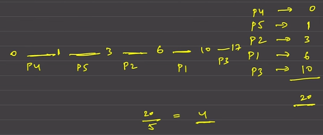

# GREEDY ALGORITHM

## Table of content
- [GREEDY ALGORITHM](#greedy-algorithm)
  - [Table of content](#table-of-content)
  - [1. Assign Cookies 4⭐](#1-assign-cookies-4)
    - [Approach](#approach)
  - [2. Fractional Knapsack 3⭐](#2-fractional-knapsack-3)
    - [Approach](#approach-1)
  - [3. Minimum number of coins 4⭐](#3-minimum-number-of-coins-4)
    - [Approach](#approach-2)
  - [4. Lemonade change 4⭐](#4-lemonade-change-4)
    - [Approach](#approach-3)
  - [5. Valid Paranthesis Checker 3⭐](#5-valid-paranthesis-checker-3)
    - [Approach](#approach-4)
  - [6. N meeting in one room 3⭐](#6-n-meeting-in-one-room-3)
    - [Approach](#approach-5)
  - [7. Jump game I 4⭐](#7-jump-game-i-4)
    - [Approach](#approach-6)
  - [8. Jump game II 3⭐](#8-jump-game-ii-3)
    - [Approach](#approach-7)
  - [9. Minimum Platform 3⭐](#9-minimum-platform-3)
    - [Approach](#approach-8)
  - [10. Candy 3⭐](#10-candy-3)
    - [Approach](#approach-9)
  - [11. Shortest Job First 4⭐](#11-shortest-job-first-4)
    - [Approach](#approach-10)
  - [12. Insert Interval 3.5⭐](#12-insert-interval-35)
    - [Approach](#approach-11)
  - [13. Merge Intervals 4⭐](#13-merge-intervals-4)
    - [Approach](#approach-12)

## 1. Assign Cookies 4⭐
- **Link** -> https://leetcode.com/problems/assign-cookies/description/
- **Difficulty** -> EASY
### Approach
1. We want to fulfill the greed of mostly every child so we have distribute the cokkies in greedly 
2. For an children with greed x we will find out any cookie y >= x and fulfill his greed insted of just giving one by one
3. We will sort both the array of children and cookie, assign pointer in both array to iterate until we reach such an point there does not exit such a cookie that will fullfill the greed of child x
4. Complexity:
    - `Time` -> *O(nlogn)*: to sort the children and cookies array + *O(n)*: to fullfill the greed
    - `Space` -> *O(1)*  
5. [Table of Content](#table-of-content)

## 2. Fractional Knapsack 3⭐
- **Link** -> https://www.geeksforgeeks.org/problems/fractional-knapsack-1587115620/1
- **Difficulty** -> MEDIUM
### Approach
1. We want to maximize the value and we can take fractional part of the weights relative to the value, confusion arises take not take and even further take in whole or the fractional part
2. The key is the unitValue of value to weight like weight(20), value(100) then unit value will be value/weight = 5
3. Based on the unitValue we will take the weights, we will take from heights unitValue to the lowest until the capacity is fullfilled
4. For largest unitValue if we can accomodate in whole we will take else we take the fraction part at exit the loop
5. For getting the largest unitValue we will heap with defination as `priority_queue<pair<double, pair<int, int>>> maxHeap` { unitValue, { val[i], wt[i] } }
6. Complexity:
    - `Time` -> *O(nlogn)*: to push all the elements into the heap + *O(nlogn)*: to pop and fullfill the capacity
    - `Space` -> *O(n)*: heap space
7. [Table of Content](#table-of-content)

## 3. Minimum number of coins 4⭐
- **Link** -> https://www.geeksforgeeks.org/problems/-minimum-number-of-coins4426/1
- **Difficulty** -> HARD
### Approach
1. We want the minium number of change to be used to generate to get the sum of given number
2. We have notes from {10, 5, 2, 1}, we will divide the n by 10 store it quotient into the answer and n = n%10 we will perfrom this operation with all the changes we have
3. Complexity:
    - `Time` -> *O(1)*
    - `Space` -> *O(1)*
4. [Table of Content](#table-of-content)

## 4. Lemonade change 4⭐
- **Link** -> https://leetcode.com/problems/lemonade-change/description/
- **Difficulty** -> EASY
### Approach
1. We are running an lemonade shop and we have to mange all the bills and return true if we are able to attain the customer by returning proper change else false
2. We will keep track on number of bills of 5$ and 10$, if the given bill is 5$ just increment the 5$ counter, if it is an 10$ counter increment the 10$ counter and decrement the 5$ counter by 1, if the it is 20$ we have two options give 3 * 5$ or give 10$ + 5$ based on which we will do the inncrement and decrement
3. If for any of the above exchange we don't have enough bills straight away return false
4. Complexity:
    - `Time` -> *O(n)*: to exchange bills
    - `Space` -> *O(1)*
5. [Table of Content](#table-of-content)

## 5. Valid Paranthesis Checker 3⭐
- **Link** -> https://leetcode.com/problems/valid-parenthesis-string/description/
- **Difficulty** -> HARD
### Approach
1. This is a bit same as check parenthesis but with little twist of *, there is an * is between which can be used as '(', ')' or ' _'
2. Ex if the string -> "(*))", here * will act as '(' and the the given string is an valid parenthesis
3. We will use something as range for solving the above problem low will store the minimum of the range and high will store the maximum
4. If the char is '(' then increment both the pointer else ')' then decrement both the pointer
5. The catch is with '*' we can have three options -1, 0, 1 (-1: closing, 0: nothing, 1: opening), hence low -= 1 and high += 1 
6. If at any moment high which stores negative then straight away return false as we can't repare the string using *, if at any moment low < 0 then reDefine is as 0
7. Complexity:
    - `Time` -> *O(n)*: to traverse through each char
    - `Space` -> *O(1)*
8. [Table of Content](#table-of-content)

## 6. N meeting in one room 3⭐
- **Link** -> https://www.geeksforgeeks.org/problems/n-meetings-in-one-room-1587115620/1
- **Difficulty** -> MEDIUM
### Approach
1. We want to conducct maximum number of meeting in one room
2. If we think greedly we will conduct all the meeting have time duration very low, that will increase the count
3. We will sort the pair based on the end time of the meeting using minHeap
4. We will take the first meeting at by iterating we will count the number of meeting can be held
5. Complexity:
    - `Time` -> *O(nlogn)*: to push the end ans start timing of the meeting + *O(n)*: to iterate until heap is empty
    - `Space` -> *O(n)*: heap space
6. [Table of Content](#table-of-content)

## 7. Jump game I 4⭐
- **Link** -> https://leetcode.com/problems/jump-game/description/
- **Difficulty** -> EASY
### Approach
1. We have check whether the element i am standing at i touched one by any of the poast gone element
2. If all the jump are resulting ending to the 0 then the answer in false, even one of the element goes to the next element then 0 then reaching end is possible
3. We will maintain an maxReach variable to store the maximum far away we can go by using all the jump we can use
4. If at any moment maxReach < i then return false, either way return true;
5. Comlexity:
    - `Time` -> *O(n)*: to iterate through array
    - `Space` -> *O(1)*
6. [Table of Content](#table-of-content)

## 8. Jump game II 3⭐
- **Link** -> https://leetcode.com/problems/jump-game-ii/description/
- **Difficulty** -> MEDIUM
### Approach
1. We want the minimum numbers of jumps to be made to reach the element at n-1
2. We stand at the very beginning we will find out the max range unitl which we can reach using the current number of change, and store it as one jump
3. Futher we will find the the max range the that we can touch using all the elements int he current range we use two pointer
4. We use low and high initialized to '0' we run an while until high < n-1
5. From low -> high in this range we will find out the next range we can jump using an for loop farhtest = max(farthest, arr[i]+i) 
6. Furhter low = high+1 ad high = farthest, the moment high reaches the last element stop return the cnt
7. Complexity:
    - `Time` -> *O(n)*
    - `Space` -> *o(1)*
8. [Table of Content](#table-of-content)

## 9. Minimum Platform 3⭐
- **Link** -> https://www.geeksforgeeks.org/problems/minimum-platforms-1587115620/1
- **Difficulty** -> MEDIUM
### Approach
1. What i thought was like sort the pair of the train arrival, dep using heap and use another heap to calculate first will check if there are any train having dep < arrival of current then pop inside an while loop and at the end push the curr train details in heap and ans will be the size of the heap
2. The `OPTIMAL SOLUTION` is like we want like an log book we can think of we will sort both the arr and dep arr individually 
    - `If arr[i]<=dep[j]` means currently an train have arrived platform++ and move i pointer i++
    - `ELSE ` means the train is departing then platform-- and move j pointer j++
3. If the we get contnous three arrival then we need three platform so the ans will max(ans, platform) at the end of each iteration
4. Complexity:
    - `Time` -> *O(2nlogn)*: to sort both the arrya + *O(2n)*: to traverse through both the array and get the ans
    - `Space` -> *O(1)*
5. [Table of Content](#table-of-content)

## 10. Candy 3⭐
- **Link** -> https://leetcode.com/problems/candy/description/
- **Difficulty** -> HARD
### Approach
1. We want to give the extra candy based on the neighbours of the current whoever let me gets the max candy i will take it
2. Generally i thought of like i will look one pos ahead and behind of current and decide but it will create an uncertain answer as we don't know neighbours ahead of me
3. So we iterate throgh the loop twice from left and right and to sum up the answer we will take max(left[i], right[i])
4. Eery time the curr wants one candy more the respective neighbour
5. Complexity:
    - `Time` -> *O(3n)*: 2 for precomputation of left ans right and one for summation of answer
    - `Space` -> *O(1)*
6. [Table of Content](#table-of-content)

## 11. Shortest Job First 4⭐
- **Link** -> https://www.geeksforgeeks.org/problems/shortest-job-first/1
- **Difficulty** -> MEDIUM
### Approach
1. The question asks for the average waiting time for executing all the task where we perform smallest task first

2. So we have to just maintain 2 counter one for ans and one for waiting time but before anything we have first sort the given array
3. Add the waiting time to ans and add arr[i] to waiting time, return ans/n
4. Complexity:
    - `Time` -> *O(nlogn)*: to sort the given array + *O(n)*: to iterate through the array
    - `Space` -> *O(1)*
5. [Table of Content](#table-of-content)

## 12. Insert Interval 3.5⭐
- **Link** -> https://leetcode.com/problems/insert-interval/description/
- **Difficulty** -> MEDIUM
### Approach
1. We want to add the given newInteraval into the interval and manage the over lapping intervals
2. At first we will add all the elements from the start which are not over lapping `arr[i][1] < newInt[0]`
3. Then curr elements overlap the newInt then update the newInt until `arr[i][0] < newInt[1]` using min for start and max for end
4. We have resolved all the overlapping push the newInt into the asnwer arrat and push all the remaining array elements into the answer
5. Complexity:
    - `Time` -> *O(n)*: traverse through the array
    - `Space` -> *O(n)*: to store the asnwer
6. [Table of Content](#table-of-content)

## 13. Merge Intervals 4⭐
- **Link** -> https://leetcode.com/problems/merge-intervals/description/
- **Difficulty** -> MEDIUM
### Approach
1. Same as the above question with an small change it there exist any overlapping we have to resolve it
2. We will the second stage of the above question to solve this question
3. Complexity:
    - `Time` -> *O(n)*: to traverse through each element
    - `Space` -> *O(n)*: to store the answer
4. [Table of Content](#table-of-content)