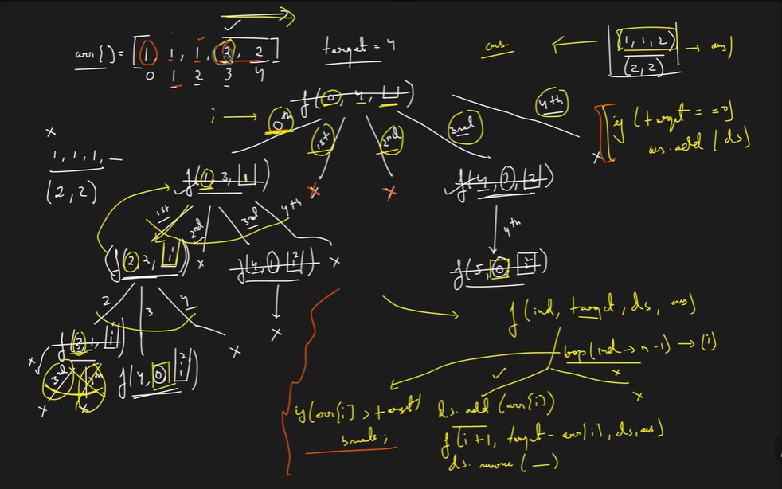
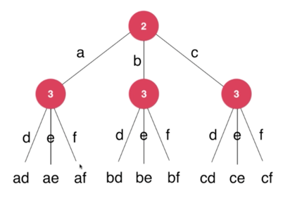
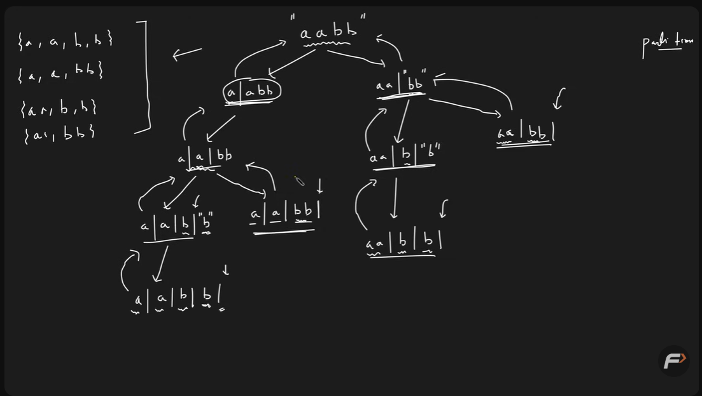

# RECURSION 

## Table Of Content
- [RECURSION](#recursion)
  - [Table Of Content](#table-of-content)
  - [1. Recursive Implementation of atoi()](#1-recursive-implementation-of-atoi)
    - [Problem Statement](#problem-statement)
    - [Iterative Approach](#iterative-approach)
    - [Recursive Approach](#recursive-approach)
  - [2. Pow(x, n)](#2-powx-n)
    - [Problem Statement](#problem-statement-1)
    - [Iterative Approach](#iterative-approach-1)
    - [Recursive Approach](#recursive-approach-1)
  - [3. Count Good numbers](#3-count-good-numbers)
    - [Problem Statement](#problem-statement-2)
  - [4. Sort a stack using recursion](#4-sort-a-stack-using-recursion)
    - [Problem Statement](#problem-statement-3)
    - [Iterative Approach](#iterative-approach-2)
    - [Recursive Approach](#recursive-approach-2)
  - [5. Reverse a stack using recursion](#5-reverse-a-stack-using-recursion)
    - [Problem Statement](#problem-statement-4)
    - [Recursive Approach](#recursive-approach-3)
  - [6. Generate all binary strings](#6-generate-all-binary-strings)
    - [Problem Statement](#problem-statement-5)
    - [Recursive Approach](#recursive-approach-4)
  - [7. Generate Paranthesis](#7-generate-paranthesis)
    - [Recursive Approach](#recursive-approach-5)
  - [8. Print all subsequences/Power Set](#8-print-all-subsequencespower-set)
    - [Recursive Approach](#recursive-approach-6)
  - [9. Count all subsequences with sum K](#9-count-all-subsequences-with-sum-k)
    - [Recursive Approach](#recursive-approach-7)
  - [10. Check if there exists a subsequence with sum K](#10-check-if-there-exists-a-subsequence-with-sum-k)
    - [Recursive Approach](#recursive-approach-8)
  - [11. Combination Sum I](#11-combination-sum-i)
    - [Recursive Approach](#recursive-approach-9)
  - [12. Combination Sum II](#12-combination-sum-ii)
    - [Recursive Approach](#recursive-approach-10)
  - [13. Subset Sum-I](#13-subset-sum-i)
    - [Recursive Approach](#recursive-approach-11)
  - [14 Subset Sum-II](#14-subset-sum-ii)
    - [Recursive Approach](#recursive-approach-12)
  - [12. Combination Sum III](#12-combination-sum-iii)
    - [Recursive Approach](#recursive-approach-13)
  - [13. Letter Combinations of a Phone number](#13-letter-combinations-of-a-phone-number)
    - [Recursive Approach](#recursive-approach-14)
  - [14. Palindrome Partitioning](#14-palindrome-partitioning)
    - [Recursive Approach](#recursive-approach-15)

## 1. Recursive Implementation of atoi()
- Link -> https://leetcode.com/problems/string-to-integer-atoi/description/
- Rating -> 2 ⭐
- Difficulty -> **HARD**
- Type -> **Decrease & Conquer**
### Problem Statement
- Implement the myAtoi(string s) function, which converts a string to a 32-bit signed integer.
- **Whitespace**: Ignore any leading whitespace (" ").
- **Signedness**: Determine the sign by checking if the next character is '-' or '+', assuming positivity if neither present.
- **Conversion**: Read the integer by skipping leading zeros until a non-digit character is encountered or the end of the string is reached. If no digits were read, then the result is 0.
- **Rounding**: If the integer is out of the 32-bit signed integer range [-231, 231 - 1], then round the integer to remain in the range. Specifically, integers less than -231 should be rounded to -231, and integers greater than 231 - 1 should be rounded to 231 - 1.
### Iterative Approach
1. Ignore Leading **WhiteSpaces**
2. If just after the whitespces it is '-', '+', '1 - 9' then only move forward else pass **NULL**
3. Convert the following numeric characters into an integer.
4. Stop when a non-digit character is found.
5. Clamp the result to the **32-bit signed integer range**:
   - If out of range, return `INT_MAX (2³¹ - 1)` or `INT_MIN (-2³¹)`.
6. Complexicity
   - Time -> O(N) 
   - Space -> O(1)
### Recursive Approach
1. Starting is same as **Iterative Approach** ignore the leading white space store the sign
2. Call an **Helper** function with first char after the sign with the sign passed as well
3. In each recursive step 
    - Stop if current char is non-digit.
    - Otherwise, accumulate the value
    - Move to the next index recursively.
4. Return the signed result (clamped to integer limits).
5. Complexicity
    - Time -> O(N)
    - Space -> O(N) -> For recursive stack space
- [To Table Of Content](#table-of-content)

## 2. Pow(x, n) 
- Link -> https://leetcode.com/problems/powx-n/description/
- Rating -> 3 ⭐
- Difficulty -> **MEDIUM**
- Type -> **Divide & Conquer**
### Problem Statement
1. mplement pow(x, n), which calculates x raised to the power n (i.e., x<sup>n</sup>).
2. **X** - can be real Number, **n** - negative, zero or positive
### Iterative Approach
1. use simple method like
    - n is even -> (x<sup>n/2</sup>)<sup>2</sup>
    - n is odd -> x*(x<sup>n-1</sup>)
2. Complexicity
    - Time -> O(Log n)
    - Space -> o(1)
### Recursive Approach
1. Same as iterative approach but insted of for for/while loop use recursive calling of same function
2. Complexicity
    - Time -> O(Log n)
    - Space -> o(Log n) -> recursive stack space
- [To Table Of Content](#table-of-content)

## 3. Count Good numbers
- Link -> https://leetcode.com/problems/count-good-numbers/description/
- Rating -> 2 ⭐
- Difficulty -> **EASY**
- Type -> **Divide & Conquer**
### Problem Statement
1. You are given a non-negative integer n
1. We define a good number of length n such that:
    - The digits at even indices (0, 2, 4, …) are even digits → {0, 2, 4, 6, 8} → 5 choices
    - The digits at odd indices (1, 3, 5, …) are prime digits → {2, 3, 5, 7} → 4 choices
1. Return the count of all possible good numbers of length n, modulo 10⁹ + 7.
****### Approach
1. calculate 5<sup>[n/2]</sup> * 4<sup>[n/2]</sup>
2. Just look out for the everflow of the limit
3. same in **Iterative** and **Recursive** approach as just an set of calculation
2. Complexicity
    - Time -> O(N)
    - Space -> O(1) -> Iterative, O(N) -> Recursive stack space
- [To Table Of Content](#table-of-content)

## 4. Sort a stack using recursion
- Link -> https://www.geeksforgeeks.org/problems/sort-a-stack/1
- Rating -> 3⭐
- Difficulty -> **MEDIUM**
- Type -> **Recursion + Helper Function**
### Problem Statement
1. Sort the stack in ascending order
1. smallest element at the bottom and largest at the top
### Iterative Approach
1. Pop elements one by one from the original stack.
2. While the top of tempStack is greater than current element, move elements back to the original stack.
1. Push the current element into the tempStack.
4. Finally, copy back all elements from tempStack to st.
5. Complexicity
    - Time -> O(n<sup>2</sup>)
    - Space -> O(n) -> extra stack space
### Recursive Approach
1. Call the same function until the last element, before each call store the **st.top()**
2. After raching top pass the stored top and stack to helper function
3. Helper function will put the passed element at bottom while also comparing the top element before adding
4. return the from recursive call same process repets until it comes down to the first call
5. Complexicity
    - Time -> O(n<sup>2</sup>)
    - Space -> O(n) -> recursive stack space
- [To Table Of Content](#table-of-content)

## 5. Reverse a stack using recursion
- Link -> https://www.geeksforgeeks.org/problems/reverse-a-stack/1
- Rating -> 3⭐
- Difficulty -> **MEDIUM**
- Type -> **Recursion + Helper Function**
### Problem Statement
1. Given a stack st[] reverse it from top to bottom
### Recursive Approach
1. In the main function we call itself **reverseStack()** until we reach the end of the stack
2. Every time before we call the function we store the top element in an varable **topElement**
3. When we reach the end we call **insertAtBottom()** to insert the stored top element in the stack
4. In the helper function if there are elements empty it along side store the top element 
5. At the end push the passed element **topElement** push it into into stack also the removed element
6. Complexicity
    - Time -> O(n<sup>2</sup>)
    - Space -> O(n) -> recursive stack space
- [To Table Of Content](#table-of-content)

## 6. Generate all binary strings
- Link -> https://www.geeksforgeeks.org/problems/generate-all-binary-strings/1
- Rating -> 2⭐
- Difficulty -> **MEDIUM**
- Type -> **Backtracking**
### Problem Statement
1. You need to generate all the binary strings of n characters representing bits.
2. Return the strings in  ascending order
### Recursive Approach
1. Start with an empty string and make recursive call like an **Binary Decision Tree**
2. Each recusive call deep until it reaches specified size, Print it
3. Go back after end push another bit '1'/'0' go deep until reach size
4. Tree Splits until all recusive call are satisfied
```arduino
                ""
            /         \
          0            1
        /   \        /    \
      00    01     10     11
     / \    / \    / \    / \
  000 001 010 011 100 101 110 111
```
5. Complexicity
    - Time -> O(n . 2<sup>n</sup>)
    - Space -> O(n) -> recursive stack space
- [To Table Of Content](#table-of-content)
	
## 7. Generate Paranthesis
- **Link** -> https://leetcode.com/problems/generate-parentheses/description/
- **Rating** -> 3⭐
- **Difficulty** -> MEDIUM
- **Type** -> `TREE RECURSION`
### Recursive Approach
1. What we have to decide is to either take or don't for both `(` and `)`
2.  We use a recursive function that keeps track of:
  - `open` → number of '(' used
  - `close` → number of ')' used
  - `curr` → current parentheses string
```bash
                              ""
                               |
                               (
                               |
                              "("
                        /----------------\
                     "(("                "()"
                      |                   |
                    "(("                 "()("
                /------------\              |
           "((("            "(()"          "()("
              |              /   \           |
           "((()"        "(()("  "(())"     "()("
              |              |       |        |
           "((())"        "(()()"   "(())("  "()()"
              |              |       |        |
           "((()))"       "(()())"  "(())()" "()()("
                                               |
                                            "()()()"

```
3. Complexity: 
$
C_n = \frac{1}{n+1}\binom{2n}{n}$
  - `Time` -> *O(C<sub>n</sub> * n)*
  - `Space` -> *O(n)* -> recursive stack space
4. [To Table Of Content](#table-of-content)

## 8. Print all subsequences/Power Set
- **Link** -> https://leetcode.com/problems/subsets/submissions/1856852108/
- **Rating** -> 3⭐
- **Difficulty** -> MEDIUM
- **Type** -> `TREE RECURSION`
### Recursive Approach
1. Same as above but the tree will extend in both way aslo comparable to `6. Generate all binary string`
1. Complexity: 
  - `Time`: *O(2<sup>n</sup> * n)*
  - `Space`: *O(n)* -> recursive stack space
3. [To Table Of Content](#table-of-content)

## 9. Count all subsequences with sum K
- **Link** -> https://leetcode.com/problems/number-of-subsequences-that-satisfy-the-given-sum-condition/description/
- **Rating** -> 3⭐
- **Difficulty** -> MEDIUM
- **Type** -> `TREE RECURSION`
### Recursive Approach
1. Same as above problems in terms of calls and creating tree
2. The change is insted of plain call return `1` and `0` based on the condition and add them up
3. In terms of time complexity and space complexity is the same is above
4. [To Table Of Content](#table-of-content)

## 10. Check if there exists a subsequence with sum K
- **Link** -> https://www.geeksforgeeks.org/problems/check-if-there-exists-a-subsequence-with-sum-k/1
- **Rating** -> 3⭐
- **Difficulty** -> MEDIUM
- **Type** -> `TREE RECURSION`
### Recursive Approach
1. Same as above problems in terms of calls and creating tree
2. The change is insted of plain call return `true` and `false` based on the condition
3. If you caught an **true** just skip all the remaining further calls and return **true**
4. In terms of time complexity and space complexity is the same is above
5. [To Table Of Content](#table-of-content)

## 11. Combination Sum I
- **Link** -> https://leetcode.com/problems/combination-sum/submissions/1858629700/
- **Rating** -> 3⭐
- **Difficulty** -> MEDIUM
- **Type** -> `TREE RECURSION`
### Recursive Approach
1. Same as the other above example with an bit change
2. We will be adding the same num until it reahes or exceeds the target
2. After which we will pop_back and increement the pos and move further
3. Complexicity
  - `Time` -> *O(2<sup>t</sup> * k)*
  - `Space` -> *Unpridictable*
1. [To Table Of Content](#table-of-content)

## 12. Combination Sum II
- **Link** -> https://leetcode.com/problems/combination-sum-ii/submissions/1858686534/
- **Rating** -> 3⭐
- **Difficulty** -> MEDIUM
- **Type** -> `Backtracking (Depth-First Search) Recursion`
### Recursive Approach
1. Treee Diagram of the Approach

1. The calls are same as like the `Comnbination I` small changes to avoid duplicates 
2. complexity: *k: average length of each combination, x: average combinations*
  - `Time` -> *O(2<sup>n</sup> * k)*
  - `Space` -> *O(k * x)* -> Ingnoring the recursive stack space
3. [To Table Of Content](#table-of-content)

## 13. Subset Sum-I
- **Link** -> https://www.geeksforgeeks.org/problems/subset-sums2234/1
- **Rating** -> 3⭐
- **Difficulty** -> MEDIUM
- **Type** -> `TREE RECURSION`
### Recursive Approach
1. Same as like question `11. Combination Sum I`
2. Just small differnce of addition and consdtion to satisyf the answer
1. Complexity: 
  - `Time` -> *O(2<sup>n</sup>)*
  - `Space` -> *O(n)* -> recusive call
2. [To Table Of Content](#table-of-content)

## 14 Subset Sum-II
- **Link** -> https://leetcode.com/problems/subsets-ii/description/
- **Rating** -> 3⭐
- **Difficulty** -> MEDIUM
- **Type** -> `Backtracking (Depth-First Search) Recursion`
### Recursive Approach
1. Same as like question `12. Combination Sum II`
2. Make changes in code of above question same as like question **12.**
1. Complexity:
  - `Time` -> *O(n.logn * n*2<sup>n</sup>)*
    - **2<sup>n</sup>** -> total subset
    - **n** -> each subset, copying it into ans
    - **nlogn** -> sorting the array
  - `Space` -> O(n) -> recursive stack space
2. [To Table Of Content](#table-of-content)

## 12. Combination Sum III
- **Link** -> https://leetcode.com/problems/combination-sum-iii/description/
- **Rating** -> 3⭐
- **Difficulty** -> MEDIUM
- **Type** -> `TREE RECURSION`
### Recursive Approach
1. Same as like `Combination I` in terms of recusive call and base case
2. The differnce ther is no array provided, we have to dynammically take it from **1 - 9**
1. Complexity same as like question `13. Subset sum-I`
4. [To Table Of Content](#table-of-content)

## 13. Letter Combinations of a Phone number
- **Link** -> https://leetcode.com/problems/letter-combinations-of-a-phone-number/submissions/1859525883/
- **Rating** -> 2⭐
- **Difficulty** -> HARD
- **Type** -> `MULTIPLE / TREE RECURSION`
### Recursive Approach
1. Generate an vector for mapping which would include all the char bunched as per the dial pad
2. The is similar like the `7. Generate Parenthesis` but a level higher in difficulty
3. We make multiple call inside an for loop with the same technique of take or not take

4. Complexity:
  - `Time` -> *O(4<sup>n</sup>)*
  - `Space` -> *O(n)* -> recursive stack space -> O(n * 4<sup>n</sup>) -> result storage
5. [To Table Of Content](#table-of-content)

## 14. Palindrome Partitioning
- **Link** -> https://leetcode.com/problems/palindrome-partitioning/
- **Rating** -> 2⭐
- **Difficulty** -> HARD
- **Type** -> `Backtracking + Depth-First Search (DFS)`
### Recursive Approach
1. We loop through char or set of charachter to find out wheteher it is palindrome or not and move further

2. Complexity: 
  - `Time` -> *O(2<sup>n</sup> * n)*
  - `Space` -> *O(n)* -> recursive stack space
3. [To Table Of Content](#table-of-content)

